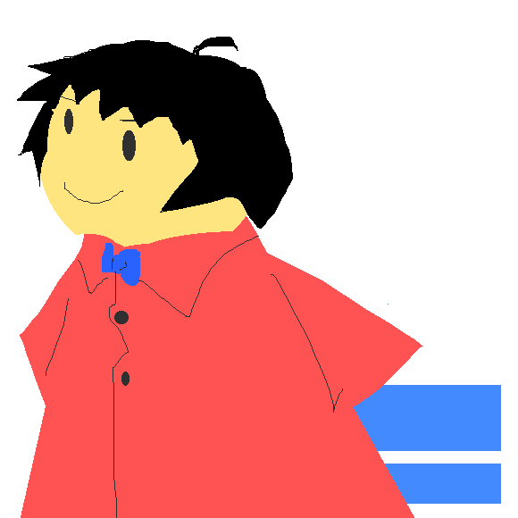

Ballen
====

「デジタルな木版画」をコンセプトとしたペイントツールです。

## Description

本ツールはElectron + React + Material UIを使用して作成されています。

## Demo

https://cuboktahedron.github.io/q/ballen/

## Licence

MIT

## Author

[cuboktahedron](https://github.com/cuboktahedron/)
